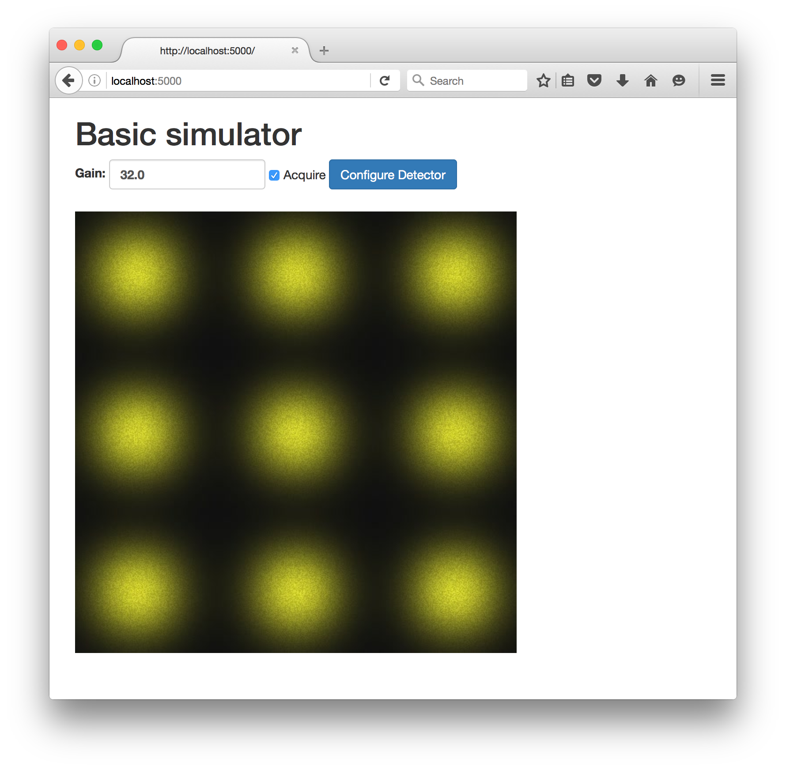

Flask-EPICS Demo
================

A demonstration of how to build a simple Flask web interface to an EPICS
areaDetector IOC.




Introduction
------------

This repo contains two `Docker <https://docs.docker.com/>`_ files:

* ``ioc.dockerfile`` to run an areaDetector IOC used by the Flask app
* ``app.dockerfile`` to run a completed version of the Flask app

Docker containers based on these files can be started and stopped with
``docker-compose`` which will also open the appropriate ports you will need.

Below are step-by-step instructions for creating the app. If you want to jump
to a finished product, see the "Run a pre-build version of the app in Docker"
section below.


Walkthrough for constructing the app
------------------------------------

1. You will need to install:

   * `Docker <https://docs.docker.com/>`_
   * Python 3 (we recommend getting it via the `Anaconda
     <https://www.continuum.io/downloads>`_ package)
   * `EPICS base <http://www.aps.anl.gov/epics/base/R3-14/12.php>`_ (if on
     Linux/Mac; not needed on Windows)

2. Download this repo and in the project folder start the simulation detector IOC with::

      docker-compose up -d ioc

3. Create a new folder called ``webdetector``. Inside this folder create a file
   called ``requirements.txt``. This is where we will list the dependencies of this
   application. Our first dependency is Flask itself. Add the word ``Flask`` to
   the ``requirements.txt`` file and run::

      pip3 install -r requirements.txt

   This will install the latest version of Flask. If you are on Linux or Mac and
   there is a permission error you may need to run
   "``sudo pip3 install -r requirements.txt``" instead.

4. Create a file called ``app.py`` that imports Flask and defines a single
   route which returns the text "Hello World!":

   .. code-block:: python

      from flask import Flask

      app = Flask(__name__)

      @app.route('/')
      def index():
          return 'Hello World!'

      if __name__ == '__main__':
          app.run(debug=True)

5. Start the app with::

      python3 app.py

   (If you are on Windows, replace ``python3`` with ``python``.)

   Once the app is running, if you open http://localhost:5000/ in a browser you
   will see the text being outputted by the ``index`` view function.

6. To interact with the simulation detector we will create a PyEPICS device.
   First we should add pyepics as a dependency and install it. Update
   ``requirements.txt`` to read::

      Flask
      pyepics

   and install pyepics with::

      pip3 install -r requirements.txt

7. In ``app.py`` import pyepics and create a detector device by adding the
   following to the top of the file (just below ``from flask import Flask``):

   .. code-block:: python

      import epics

      detector = epics.Device(prefix='SR00DEMO01:', mutable=False,
                              aliases={
                                  'model': 'CAM1:Model_RBV',
                                  'video_url': 'MPEG1:MJPG_URL_RBV',
                                  'gain': 'CAM1:Gain',
                                  'acquire': 'CAM1:Acquire',
                              })

8. Instead of returning the string ``'Hello World!'`` let's make the route return
   the model name of the detector:

   .. code-block:: python

      @app.route('/')
      def index():
          return detector.model

9. After making these changes the server should restart automatically because
   we told it to run in debug mode with ``app.run(debug=True)`` in ``app.py``.
   Reload http://localhost:5000/ in your browser and you will see "Basic
   simulator" as that is the model of our "detector".

10. Instead of returning plain text we wish to return a HTML page which will
    allow us to embed the video stream of the camera and add widgets for
    controlling it. Flask makes this easy through it's ``render_template``
    function, which takes the filename of a Jinja2 html template that is
    expected to be in a folder named ``templates``. Create simple template at
    ``templates/index.html``:

    .. code-block:: html

       <!DOCTYPE html>
       <html lang="en">
       <body>
         <h1>{{ detector.model }}</h1>
       </body>
       </html>

    This template expects a variable named ``detector`` to be supplied and will
    extract the ``model`` attribute from this object and insert it in a HTML
    heading tag. Back in ``app.py`` we need to import the ``render_template``
    function and call it from our ``index`` view function:

    .. code-block:: python

       from flask import Flask, render_template
       import epics

       detector = epics.Device(prefix='SR00DEMO01:', mutable=False,
                               aliases={
                                   'model': 'CAM1:Model_RBV',
                                   'video_url': 'MPEG1:MJPG_URL_RBV',
                                   'gain': 'CAM1:Gain',
                                   'acquire': 'CAM1:Acquire',
                               })

       app = Flask(__name__)

       @app.route('/')
       def index():
           return render_template('index.html', detector=detector)

       if __name__ == '__main__':
           app.run(debug=True)

    If you reload http://localhost:5000/ the detector model will now be a large
    heading.

11. To add the detector video stream to our web page we need the url of the
    mjpeg stream. This is given by the PV connected to ``detector.video_url``.
    Unfortunately, because this PV is a character array, PyEPICS will return it
    as a list of integers. To force it to return the url as a string we need to
    call ``detector.get('video_url', as_string=True)``. We do this inside our
    view function and then supply the result to the template:

    .. code-block:: python

       @app.route('/')
       def index():
           video_url = detector.get('video_url', as_string=True)
           return render_template('index.html', detector=detector, video_url=video_url)

    Then in our ``index.html`` file we add the video stream using the ````
    tag:

    .. code-block:: html

       <!DOCTYPE html>
       <html lang="en">
       <body>
         <h1>{{ detector.model }}</h1>
         
       </body>
       </html>

    If you reload http://localhost:5000/ you will see the video stream.

12. We can now add controls for our detector by creating a HTML form that users
    can enter values in and submit to the server. We will start by just adding
    a text box to set the detector gain level and a submit button:

    .. code-block:: html

      <!DOCTYPE html>
      <html lang="en">
      <body>
        <h1>{{ detector.model }}</h1>
        <form method="POST" action="/configure">
          <input name="gain" value="{{ detector.gain }}"/>
          <button type="submit">Configure Detector</button>
        </form>
        <br/>
        
      </body>
      </html>

    When the user hits submit the browser will do a POST request to
    http://localhost:5000/configure with the data from the form. If you try doing
    this now you will get a "404 Not Found" error because we haven't configured
    Flask to handle requests to the ``/configure`` route.

13. In ``app.py``, add a function to handle POST requests to ``/configure``. We
    also need to import the special ``request`` object that gives us access to
    the data the user send through in their POST request. We also import the
    sleep function and add a short delay after setting the detector gain to
    give EPICS time to process the change.

    .. code-block:: python

       from time import sleep
       from flask import Flask, render_template, request
       import epics

       [...]

       @app.route('/configure', methods=['POST'])
       def configure():
           data = request.form
           detector.gain = float(data['gain'])
           sleep(.1)
           return 'configured!'

       [...]

    Now when you enter a new gain value on the web page and hit submit the gain
    will be set and you will get a "configured!" message.

14. It would be better if after configuring the detector users are redirected
    back to the main page. We can do this by importing the Flask redirect
    function and calling it from the ``configure`` function:

    .. code-block:: python

       from time import sleep
       from flask import Flask, render_template, request, redirect
       import epics

       [...]

       @app.route('/configure', methods=['POST'])
       def configure():
           data = request.form
           detector.gain = float(data['gain'])
           sleep(.1)
           return redirect('/')

       [...]

15. Another control we might want is to be able to start and stop the detector.
    We can do this by adding a checkbox to our form:

    .. code-block:: html

       <!DOCTYPE html>
       <html lang="en">
       <body>
         <h1>{{ detector.model }}</h1>
         <form method="POST" action="/configure">
           <label>Gain:
             <input name="gain" value="{{ detector.gain }}"/>
           </label>
           <label>
             <input type="checkbox" name="acquire"
                    checked/> Acquire
           </label>
           <button type="submit">Configure Detector</button>
         </form>
         <br/>
         
       </body>
       </html>

    and then setting the ``detector.acquire`` attribute appropriately our
    ``configure`` view function:

    .. code-block:: python

       @app.route('/configure', methods=['POST'])
       def configure():
           data = request.form
           detector.gain = float(data['gain'])
           detector.acquire = 1 if 'acquire' in data else 0
           sleep(.1)
           return redirect('/')

16. We may want to only allow authorised users to configure our detector. We
    can do this by requiring a login whenever someone tries to access the
    ``/configure`` route. Flask has an excellent range of extensions and one
    such extension to add authorisation checks is `Flask-HTTPAuth
    <https://flask-httpauth.readthedocs.io>`_. Let's add it to
    ``requirements.txt``::

       Flask
       Flask-HTTPAuth
       pyepics

    and install it::

       pip3 install -r requirements.txt

    then to use it we import and create an instance of the ``HTTPBasicAuth``
    class and then define a function to return passwords for a supplied
    username:

    .. code-block:: python

       from time import sleep
       from flask import Flask, render_template, request, redirect
       from flask_httpauth import HTTPBasicAuth
       import epics

       detector = epics.Device(prefix='SR00DEMO01:', mutable=False,
                               aliases={
                                   'model': 'CAM1:Model_RBV',
                                   'video_url': 'MPEG1:MJPG_URL_RBV',
                                   'gain': 'CAM1:Gain',
                                   'acquire': 'CAM1:Acquire',
                               })

       app = Flask(__name__)
       auth = HTTPBasicAuth()

       @auth.get_password
       def get_password(username):
           return '1234'

       [...]

    To require a password on our ``configure`` function we just apply the
    ``@auth.login_required`` decorator:

    .. code-block:: python

       @app.route('/configure', methods=['POST'])
       @auth.login_required
       def configure():
           data = request.form
           detector.gain = float(data['gain'])
           detector.acquire = 1 if 'acquire' in data else 0
           sleep(.1)
           return redirect('/')

    Now try loading http://localhost:5000/ and configuring the detector. It
    will ask for a password (1234). Once you are logged in it won't prompt you
    for a password again unless you close and re-open your browser.

17. Currently our web app looks OK, on a desktop computer but it won't work
    very well on mobile or desktop. To fix this and make our app look a little
    more modern we can use the `Bootstrap <https://getbootstrap.com/>`_ styling
    framework. There is a Flask extension called `Flask-Bootstrap
    <https://pythonhosted.org/Flask-Bootstrap/>`_ that makes it trivial to add
    Bootstrap to our app.

    Add Flask-Bootstrap to ``requirements.txt``::

       Flask
       Flask-HTTPAuth
       Flask-Bootstrap
       pyepics

    and run ``pip3 install -r requirements.txt``. Then apply Bootstrap to our
    app object like so:

    .. code-block:: python

       from time import sleep
       from flask import Flask, render_template, request, redirect
       from flask_httpauth import HTTPBasicAuth
       from flask_bootstrap import Bootstrap
       import epics

       [...]

       app = Flask(__name__)
       auth = HTTPBasicAuth()
       Bootstrap(app)

    Next we update our ``index.html`` template to inherit from the
    ``bootstrap/base.html`` template. We move our code into the ``content``
    block and add a few html classes that bootstrap uses to style our page. The
    entire contents of ``index.html`` should be replaced with:

    .. code-block:: html

       

       

         <div class="container">
           <h1>{{ detector.model }}</h1>
           <form method="POST" action="/configure" class="form-inline">
             <label>Gain:
               <input name="gain" value="{{ detector.gain }}"
                      class="form-control"/>
             </label>
             <div class="checkbox">
               <label>
                 <input type="checkbox" name="acquire"
                        checked/> Acquire
               </label>
             </div>
             <button type="submit" class="btn btn-primary">Configure Detector</button>
           </form>
           <br/>
           
         </div>

       

    Reload the page and everything should look a little prettier and will now
    look great on mobiles and tablets.


Run a pre-build version of the app in Docker
--------------------------------------------

1. Install `Docker <https://docs.docker.com/>`_.
2. Download this repository.
3. From inside the project folder run::

      docker-compose up -d

The first time you run this it may take a few minutes to download the docker
images it needs. Once this is done you will be able to access the site at
http://localhost:5000/.
